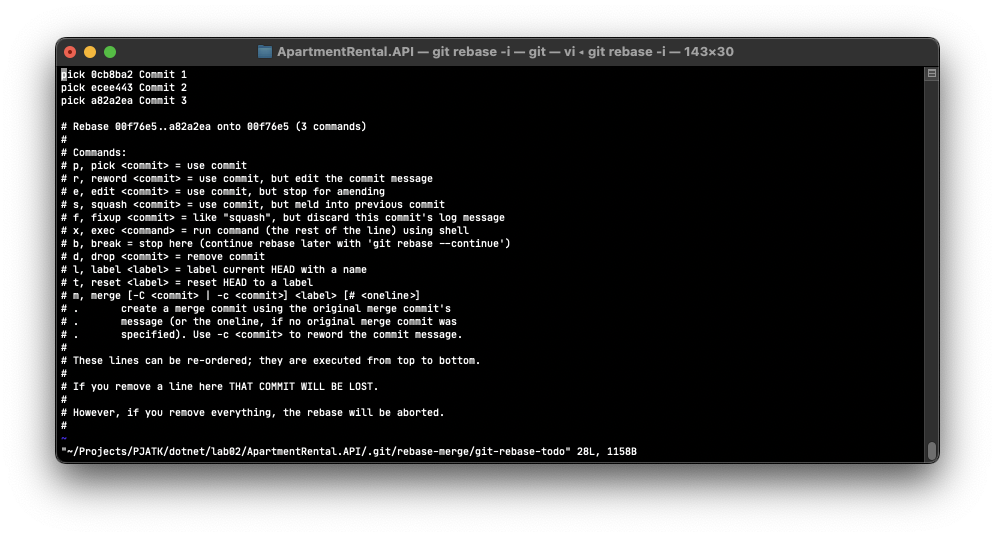
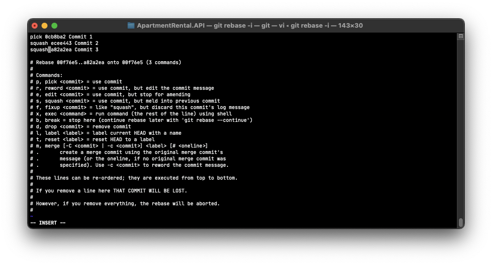
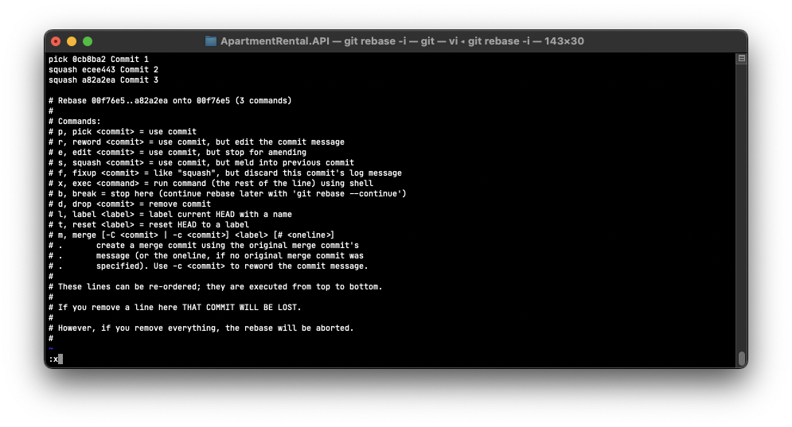
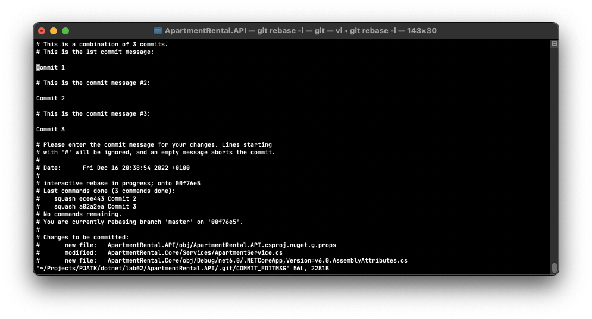
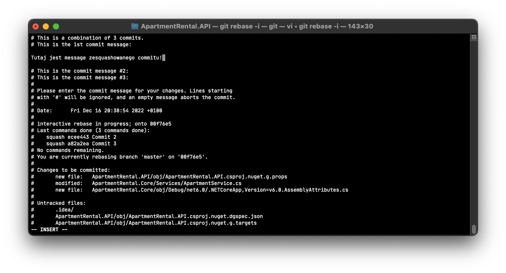
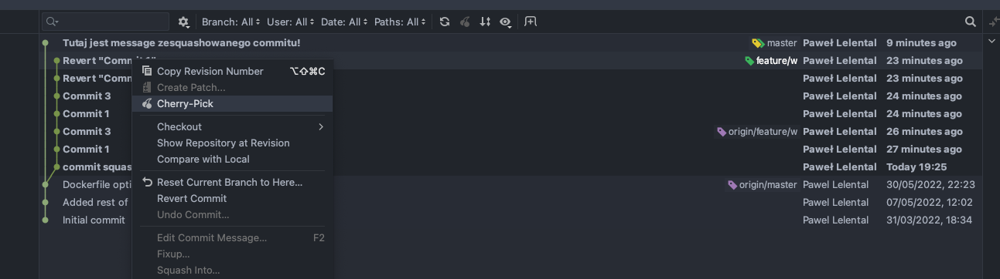

# UKOS laboratoria - praca z repozytorium część 2 i 3

## Wprowadzenie
### Fork
Fork to nowe repozytorium, które dzieli kod i ustawienia widoczności z oryginalnym repozytorium. Operacja kopiuje główne repozytorium na nasze główne konto. Forka można dokonać wchodząć na główną stronę repozytorium, które chcemy skopiować, a nastepnię klikając w zielony przycisk po prawej stronie z napisem `Fork`.
### Markdown
Markdown to lekki język znaczników ze składnią formatowania zwykłego tekstu. Pliki w języku MarkDown są standardem w branży do tworzenia tzw. plików Readme, które służą do opisania oraz stworzenia instrukcji do naszego repozytorium, bądź projektu. \
Podstawy języka markdown dostępne są pod danym linkiem: [Markdown Syntax](https://www.markdownguide.org/basic-syntax/).\
Podczas zajęć potrzebne będzie użycie takich znaczników jak
   - Headings `#`
   - Lista `-`
   - Link do obrazka ``
   - formatowanie jako "kod" \` <kod> \` 
### Squash
Squash jest sposobem na przepisanie historii commitów; ta akcja pomaga oczyścić i uprościć historię commitów przed podzieleniem się swoją pracą z członkami zespołu. Squash commitów oznacza, że bierzesz zmiany z jednego commitu i dodajesz je do commitu macierzystego.
   
Aby dokonac squasha w terminalu, należy użyć interkatywnej funkcji rebase za pomocą komendy `git rebase -i`. Komenda powoduje otwarcie listy z historią commitów w edytorze VIM. Aby rozpocząć edycje tekstu za kursorem należy naciśnąć przycisk `i` na klawiaturze. Wówczas należy wybrać z listy commitów te które, powinny zostać zesquashowane. 

Aby tego dokanać, należy przy odpowiednich commitach zamienić słowo `pick` na `squash` bądź `s`.

By wyjść z trybu edycji należy wciśnąć przycisk `esc` na klawiaturze. Aby zapisać zmiany należy dokonać poniższej komnbinacji znaków na klawiaturze: `:x`.

Następnym oknem po zapisie, jest okno wyboru wiadomości commitów.

Za pomocą wcześniej podanych kombinacji klawiszy, należy usunąć wiadomości dla ze squashowanych commitów oraz zedytować pierwszy commit message. 
   
### Cherry-pick
Cherry-pick to zaawansowane polecenie, które umożliwia wybranie dowolnego commita Git przez referencję i dołączenie go do bieżącego roboczego wskaźnika HEAD. Operacja „cherry pick” polega na wybraniu commita z gałęzi i dołączeniu go do innej gałęzi. Polecenie git cherry-pick może być przydatnym narzędziem do cofania zmian. Załóżmy na przykład, że commit zostanie przypadkowo wprowadzony w niewłaściwej gałęzi. Możesz przełączyć się do właściwej gałęzi i za pomocą operacji „cherry pick” wstawić commit tam, gdzie powinien się znaleźć. - By Atlassian.

Operacje prosto można również wykonać za pomocą graficznych interejsów użytkownika dla Gita takich jak SourceTree, czy wbudowane narzędzia w IDE. W najpopularniejszych rozwiązaniach często wystarczy w historii commitów wybrać interesujący nas commit za pomocą prawego przyciska myszy oraz kliknąć polecenie `cherry-pick`.

   
      
## Zadania   
1. Wykonaj forka bieżącego repozytorium do swojego konta na Githubie
2. Z clonuj repozytorium na lokalną maszynę
3. Stwórz brancha `feature/<twoj_numer_indeksu>/markdown`
4. Stwórz plik `AboutMe.md` i uzupełnij go. Przejrzyj najpierw skladnie pliku `README.md`. Plik `AboutMe.md` powinien zawierać takie dane jak (każdy z podpunktów powinien zostać wykonany jako osobny commit):
   - Krótki opis przedstawiający kim jesteś
   - Listę Twoich hobby
   - Obraz z kotem
   - Link do twojego Githuba
5. Dokument powinien być odpowiednio sformatowany
   - Każdy z punktów powinien mieć swój własny heading
   - Lista z hobby powinna zostać stworzona jako unordered list
   - Obrazek powinien być po prostu linkiem do obrazku z internetu
   - Link do GitHuba powinien zostać sformatowany jako "kod"
7. Za pomocą komendy `git rebase -i` w konsoli dokonaj squasha trzech commitów. Zesquashowany commit powinien mieć następującą nazwę `squashed commits <numder indeksu> - added AboutMe.md file`
9. Wypushuj zmiany na remote
10. Stwórz PR i poproś prowadzącego. Po pomyślnej weryfikacji zmerguj PR
11. Z głównego brancha stwórz nowego brancha o nazwie `feature/<twoj_numer_indeksu>/gui`
12. Z głównego brancha stwórz nowego brancha o nazwie `feature/<twoj_numer_indeksu>/cherrypick`
13. Wróć do głównego brancha i wpliku AboutMe.md dodaj jeden znak specjalny do pierwszej linijki i wypushuj zmiany
14. Wróć do brancha `feature/<twoj_numer_indeksu>/gui`
15. Otwórz repozytorium w jednym z narzędzi, który umożliwia steowanie gitem za pomocą graficznego interfejsu użytkownika (Jetbrains/Sourcetree)
16. Zrób zmiany w pliku `AboutMe.md`, dodaj zdanie "lorem ipsum" w pierwszej linijce
17. Zacommituj i wypushuj zmiany za pomocą graficznego interfejsu użytkownika
18. Za pomocą GUI zrób rebase, rozwiąż konflikty oraz wypushuj rozwiązane konflikty na remote
19. Stwórz PullRequesta i poproś prowadzącego. Po pomyślnej weryfikacji zmerguj PR.
20. Wróc do brancha `feature/<twoj_numer_indeksu>/cherrypick`
21. Zrób cherry-picka ostatniego commita z głównego brancha
22. Wypushuj zmiany, stwórz PR i poproś prowadzącego
